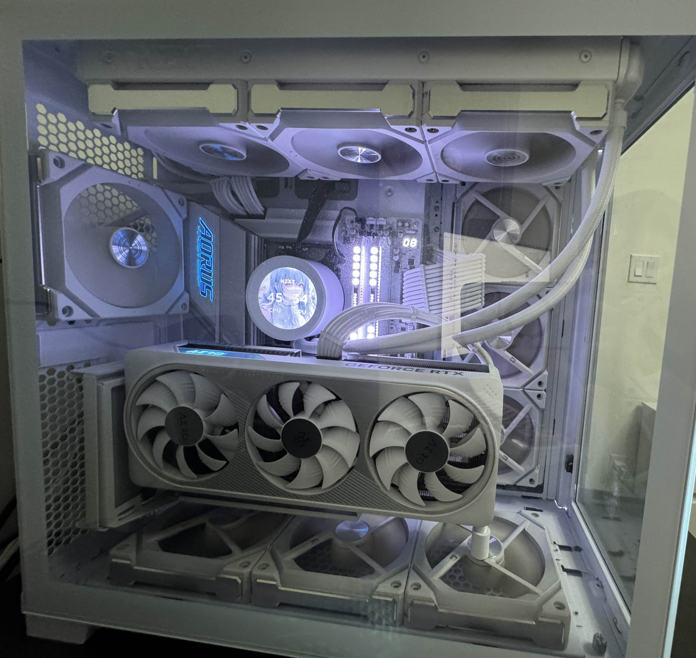

Before the year began, I started considering upgrading my PC because of reports about Intel processors overheating and potentially damaging other components. I began saving money for a new processor. Later, I heard about a new processor being released that was expected to outperform the Ryzen 7 7800X3D. After researching and reviewing several benchmarks, I saw it offered significant improvements over previous generations. Since I enjoy gaming whenever I have free time at home, I decided to plan for this upgrade. However, I also realized that my current motherboard wouldn’t be compatible with the new CPU, so I’d need to save up even more to buy a suitable motherboard as well.

<pre>

</pre>

Source: I used Chatgpt to fix my grammar, vocabulary, and pronunciation. 
