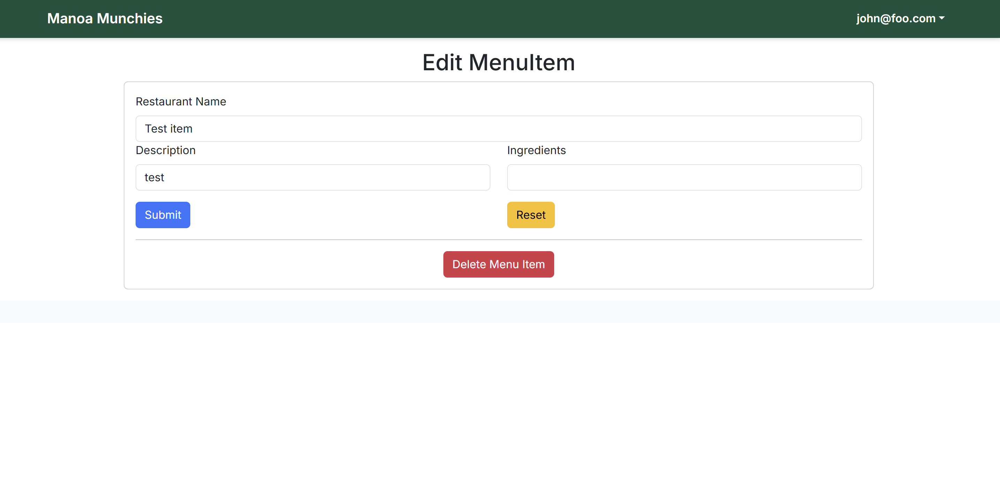

**Campus Craving**

**Overview**

Throughout the development of our campus vendor food app, I gained valuable insights into the software engineering process, from ideation and design to collaboration and implementation. Our goal was to create a platform where students could easily browse food options available on campus, view daily specials, and make informed choices based on availability, price, and dietary needs.

One of the most rewarding aspects of the project was solving a real-world problem for our campus community. Students often don’t have time to walk around and check what each food vendor is offering. By centralizing this information in one easy-to-use application, we aimed to save time and reduce frustration, especially during busy hours.

Overall, this project deepened my understanding of full-stack web development and how software can be used to improve everyday life. It reminded me that the best applications are built not just with good code, but with empathy for the users and teamwork among developers.

**What I learned**

Working on the campus vendor food app taught me many valuable lessons in software development, teamwork, and user-centered design.

One of the biggest things I learned was developing a full-stack web application using modern tools and frameworks. I gained experience working with technologies like React, MongoDB, and Next.js, which helped me understand how frontend and backend components connect and communicate. I also learned how to manage and organize large codebases, use version control effectively with Git, and deploy our project so others could use it online.

Another major takeaway was the importance of user experience (UX). Building this app made me think about what users need, not just what I wanted to build. We had to design clean layouts, make navigation simple, and ensure that the most important information, like daily menus, was easy to find. I realized that good design isn't just about making things look nice, it's about making them usable and helpful.

I also learned a lot about working in a team. We used Agile development practices like issue-driven project management, which helped us break down the project into smaller tasks and stay on track. I improved my communication skills by participating in group discussions, doing code reviews, and collaborating on GitHub. This made me more confident about contributing to group projects and asking for help when needed.

Finally, I learned that real-world software development is all about solving problems. Our goal was to make campus food information easier to access, and by the end, we had created something that could help students in their daily lives. That feeling of building something useful was one of the most motivating parts of the entire experience.

---

**Projects**

Site:<a href="https://manoa-munchies-nextjs.vercel.app/"><i class="large github icon "></i>Campus Craving</a>

Documentation: <a href="https://live-laugh-lockheed-martin.github.io/"><i class="large github icon "></i>Organization Page</a>
